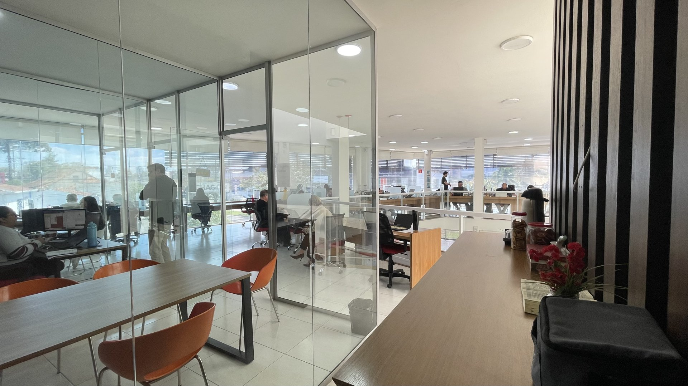

<!-- _class: cena centro -->


<div class="veu" style="background:radial-gradient(ellipse at center, rgba(0,0,0,.9) 0%, rgba(0,0,0,.55) 55%, rgba(0,0,0,.25) 100%)"></div>

<div class="gigante">harness?</div>

<div class="sub" style="font-size:48px;margin-top:36px">Sabe o que é isso?</div>

<!--
⏱ 00:00–04:00 · BLOCOS 0 E 1 · ABERTURA E A GRANDE DÚVIDA

Abertura falada (00:00–02:00)
- A dor deles antes de qualquer conceito: prospecção e WhatsApp comendo a semana.
- "Quem já passou uma manhã só achando para quem mandar mensagem?" Mão levantada.
- "Quem tem lead parado no WhatsApp esperando retomada agora?"
- Não cite número de horas. Deixe a sala dizer.

A grande dúvida (02:00–04:00)
- "Sabe o que é harness? Já ouviu falar?"
- Espere. NÃO responda. Se alguém arriscar, não confirme nem corrija.
- Diga literalmente: "Guarda essa palavra, é a pergunta que a gente vai fechar no final."

ANTES DA AULA
- Peça que todos instalem o Antigravity em casa (antigravity.google/download): o download na rede da sala pode travar o exercício.
- Conta Google pessoal (@gmail) de cada um em mãos.
-->

---

<!-- _class: cena -->


<div class="veu"></div>

<div class="frase">A IA é o <strong>gênio da lâmpada</strong> do mundo digital</div>

<!--
⏱ 04:00–08:00 · BLOCO 2 · IA = GÊNIO

- "Você pede, ele atende."
- "Ele atende ao pé da letra. Inclusive quando o pedido está mal feito."
- "Gênio de história: você pede para ficar rico e ele te afoga em moeda."
-->

---

<!-- _class: cena baixo -->


<div class="veu"></div>

<div class="frase larga">O prompt é igual ao <strong>pedido ao gênio</strong></div>

<div class="faixa-icones">
<div class="icone">Contexto</div>
<div class="icone">Intenção</div>
<div class="icone">Papel</div>
<div class="icone">Objetivos</div>
<div class="icone">É · Não é</div>
</div>

<!--
⏱ 08:00–19:00 · BLOCOS 3 E 4 · PROMPT = PEDIDO · ESTRUTURA

Bloco 3 (08:00–12:00)
- "Prompt é o nome técnico do pedido. É o que você escreve na caixinha."
- "Pedido mal feito, desejo mal realizado."
- Exemplo: "Escreve uma mensagem para um cliente de consórcio." Ele entrega uma mensagem, para qualquer cliente, sobre nada. Qual cliente? Onde a conversa parou? Não estava no pedido.

Bloco 4 (12:00–19:00), um exemplo de consórcio por ícone
- Contexto: "cliente pediu simulação de carta de imóvel há 20 dias e parou de responder."
- Intenção: "retomar a conversa sem pressionar."
- Papel (ou persona, NUNCA "personificação"): "você é um consultor de consórcio que escreve curto, sem jargão."
- Objetivos: "até 3 linhas, terminando numa pergunta simples."
- É: "retomada de conversa." Não é: "promessa de contemplação, de sorteio ou de rendimento." Se você não proíbe, ele pode prometer.
-->

---

<div class="lado">
<div>
<div class="icone">estúpido</div>
<div class="cartao ruim">Escreve uma mensagem para um cliente de consórcio.</div>
<div class="cartao ruim">…ótima <span class="problema">oportunidade de investimento</span>… <span class="problema">contemplado rapidinho</span>!</div>
</div>
<div>
<div class="icone">sábio</div>
<div class="cartao bom"><div class="tags"><span>Contexto</span><span>Intenção</span><span>Papel</span><span>Objetivos</span><span>Não é</span></div></div>
<div class="cartao bom">Oi, Carla! Você comentou que a parcela ficou alta. Refaço com uma carta menor?</div>
</div>
</div>

<!--
⏱ 19:00–37:00 · BLOCOS 5a E 5b · GÊNIO ESTÚPIDO × SÁBIO · OS DOIS LIMITES

Bloco 5a (19:00–27:00)
- "Mesmo pedido, duas formulações, dois resultados."
- Pedido do sábio, em voz alta: "Você é um consultor de consórcio que escreve curto, sem jargão. A Carla pediu simulação de carta de imóvel há 20 dias e sumiu. Disse que a parcela parecia alta. Quero retomar sem pressionar. Até 3 linhas, terminando em pergunta. Não prometa contemplação, sorteio ou rendimento."
- Esquerda: genérica, chama consórcio de investimento e promete contemplação rápida.
- Direita: cita a objeção da própria cliente, curta, termina em pergunta.
- "O gênio sábio não é mais inteligente. Ele recebeu papel, contexto e limites."
- Respostas na tela são ilustrativas.

Bloco 5b (27:00–37:00), falado, sem slide próprio
Janela de contexto, a peça de dominó do resto da aula:
- "A lâmpada esvazia toda noite. Ele não lembra de ontem. E mesmo hoje, só segura um tanto."
- "Conversa longa degrada: o que você disse no começo vai escapando."
- "Toda conversa nova: quem você é, como escreve, o que não pode prometer. De novo."
- FRASE-MOTE (1ª de 3): "Cada conversa te faz repetir tudo de novo — a menos que você guarde o que aprendeu em algum lugar."
Alucinação, enquadramento obrigatório:
- "O gênio inventa, com confiança. Pode citar uma regra de consórcio que não existe, ou uma taxa que ninguém te passou."
- "Alucinação NÃO é causada por prompt ruim. O sábio erra menos e o erro aparece mais, mas os dois inventam."
- "Conferir é rotina permanente, não conserto de prompt."
-->

---

<!-- _class: cena baixo -->


<div class="veu"></div>

<div class="frase larga">O harness ajusta a IA a um <strong>propósito</strong></div>

<div class="sub">Automatizar o dia a dia do consultor Ademicon</div>

<!--
⏱ 37:00–41:00 · BLOCO 6 · PROPÓSITO

PONTE ENTRE AS DUAS PEÇAS, EM VOZ ALTA:
"Até aqui a gente falou do gênio: atende ao pé da letra, esquece tudo à noite e inventa com confiança. Agora vem a segunda peça. Porque um gênio, por melhor que seja, num escritório vazio, só sabe conversar. O que faz ele trabalhar é o lugar onde ele está."

- "No nosso caso, o propósito é automatizar o dia a dia do consultor: achar para quem ligar, escrever a retomada, organizar a agenda. Enquanto você fica com o cliente."
- Pode usar a palavra harness, mas NÃO feche a definição: isso é o próximo slide.
-->

---

<!-- _class: cena baixo -->


<div class="veu"></div>

<div class="selo">escritório vazio</div>

<!--
⏱ 41:00–43:00 · BLOCO 7 · ESCRITÓRIO VAZIO

- "Coloquem o gênio sábio aqui. Sem mesa, sem cadeira, sem telefone, sem CRM, sem planilha, sem agenda. O que ele consegue fazer?"
- Deixe a sala responder: "Só conversar."
-->

---

<!-- _class: cena baixo -->



<div class="veu"></div>

<div class="gigante" style="font-size:170px">harness</div>

<div class="selo" style="margin-top:20px">escritório equipado</div>

<!--
⏱ 43:00–48:00 · BLOCOS 7 E 8 · ESCRITÓRIO EQUIPADO · FECHA A DÚVIDA

- "Agora deem a ele telefone, CRM, planilha e agenda. Agora ele trabalha."
- "Lembram da palavra do começo?" Espere alguém dizer "harness".
- "Harness é o escritório equipado em volta do gênio. O gênio é a IA. O escritório é o que faz ela trabalhar para um propósito. Aquela pergunta está fechada."
-->

---

<div class="tres">
<figure><figcaption>Personalização<small>o manual</small></figcaption></figure>
<figure><figcaption>Skill<small>o procedimento</small></figcaption></figure>
<figure><figcaption>Agente<small>"resolve"</small></figcaption></figure>
</div>

<!--
⏱ 48:00–52:00 · BLOCO 9 · PERSONALIZAÇÃO, SKILL, AGENTE

- Personalização = o manual da empresa que ele lê antes de começar. "Sou consultor de consórcio. Escrevo curto. Nunca prometo contemplação, sorteio ou rendimento." Escreve uma vez, ele lê antes de cada conversa.
- Skill = o procedimento colado na parede. "Retomar lead parado: ler a última objeção, escrever até 3 linhas citando a objeção, terminar com uma pergunta." Escreve uma vez, ele segue toda vez.
- Agente = quando você para de ditar e diz "resolve". "Olha minha carteira e me diz com quem falar hoje, e o que dizer." Ele decide os passos.
- "A conversa NÃO acumula sozinha. O acúmulo mora no manual, no procedimento e nas fontes conectadas. Não no chat."
- FRASE-MOTE (2ª de 3): "Cada conversa te faz repetir tudo de novo — a menos que você guarde o que aprendeu em algum lugar." Aponte: "Em algum lugar é aqui."
-->
---

<div class="cabeca"><span class="selo">o caso</span><h2 style="margin:0">Calculadora × Calculista</h2></div>

<div class="lado">
<div>
<div class="rotulo">skill · calculadora.md</div>
<div class="frase" style="font-size:38px;max-width:none;white-space:nowrap">faz a conta <strong>com você</strong></div>
<ul class="lista-curta">
<li>O cliente perguntou a parcela</li>
<li>Lance embutido enquanto escreve</li>
<li>Usa o que a conversa já sabe</li>
</ul>
</div>
<div>
<div class="rotulo sabio">agente · calculista.md</div>
<div class="frase" style="font-size:38px;max-width:none;white-space:nowrap">confere a conta <strong>por você</strong></div>
<ul class="lista-curta">
<li>Confere os números da mensagem</li>
<li>Comparativo que vai ao cliente</li>
<li>Só lê e calcula, não edita nada</li>
</ul>
</div>
</div>

<!--
⏱ 52:00–54:00 · BLOCO 9 · CALCULADORA × CALCULISTA

- "O caso da aula: a calculadora e o calculista."
- Calculadora é skill: o jeito de fazer a conta, com as fórmulas. Roda dentro da conversa, junto com tudo o que já foi dito — a objeção, o valor que cabe no bolso.
- Calculista é agente: um colega de fora, em sala própria. Recebe o caso, faz ou confere a conta, e não mexe em nada.
- A ponte: o calculista USA a calculadora. As fórmulas moram num lugar só; o agente soma os limites e a independência.
- A pergunta que decide: "a conta faz parte da conversa, ou precisa de alguém de fora?"
- Frase para a sala: "a calculadora faz a conta com você; o calculista confere a conta por você."
- Quem confere não pode ser quem escreveu: é por isso que a conferência vai para o agente.
-->

---

<div class="cabeca"><span class="selo">skill × agente</span><h2 style="margin:0">Quando usar cada um</h2></div>

<div class="tabela-curta">

| | **Skill** · calculadora | **Agente** · calculista |
|---|---|---|
| Na metáfora | O procedimento na parede | Um colega com sala própria |
| Onde roda | Na mesma conversa | Em sessão separada |
| Ferramentas | As da conversa | Só as que você libera |
| Protege | Nada além das regras | Limita o que pode fazer |
| Quando usar | Tarefa que se repete na conversa | Tarefa que pede limite ou independência |
| Arquivo | `.agents/skills/calculadora/SKILL.md` | `.agents/agents/calculista.md` |

</div>

<!--
⏱ 54:00–56:00 · BLOCO 9 · SKILL × AGENTE

- Leia linha a linha, sempre voltando ao caso: calculadora de um lado, calculista do outro.
- "Quase tudo que vocês vão criar no começo é skill. Agente aparece quando surge a necessidade de separar: um revisor que não escreve, um calculista que não mexe em arquivo."
- O custo do agente é maior: além do procedimento, definir o que ele pode e não pode usar.
-->


---

<div class="glossario">
<div class="termo"><b>LLM</b><span>o gênio</span></div>
<div class="termo"><b>Prompt</b><span>o pedido</span></div>
<div class="termo"><b>Contexto</b><span>o que ele precisa saber</span></div>
<div class="termo"><b>Papel</b><span>quem ele é no pedido</span></div>
<div class="termo"><b>Janela de contexto</b><span>a lâmpada que esvazia</span></div>
<div class="termo"><b>Alucinação</b><span>inventa com confiança</span></div>
<div class="termo"><b>Harness</b><span>o escritório equipado</span></div>
<div class="termo"><b>Personalização</b><span>o manual</span></div>
<div class="termo"><b>Skill</b><span>a calculadora</span></div>
<div class="termo"><b>Agente</b><span>o calculista</span></div>
<div class="termo"><b>Conector</b><span>o telefone do escritório</span></div>
<div class="termo"><b>Limite de uso</b><span>quanto dá por período</span></div>
</div>

<!--
⏱ 56:00–59:00 · BLOCO 10 · REVISÃO DOS CONCEITOS

- Passe um por um, só o nome e a metáfora. Não abra conceito novo.
- LLM é o nome técnico do modelo de linguagem: o gênio.
- Conector é o que liga o gênio a uma ferramenta (Drive, agenda). O WhatsApp não tem conector.
- NÃO ensinar "tokens": é conceito de API e cria modelo mental falso para quem usa assinatura.
-->

---

<!-- _class: centro -->

<div class="icones" style="gap:120px">
<div class="icone grande">limite de uso</div>
<div class="icone grande">tamanho da conversa</div>
</div>

<div class="icones" style="margin-top:48px;align-items:center">
<div class="icone">hoje</div>
<div class="seta">→</div>
<div class="icone">bateu</div>
<div class="seta">→</div>
<div class="icone">plano pago</div>
</div>

<!--
⏱ 59:00–62:00 · BLOCO 10 · ASSINATURA E LIMITES

- Limite de uso: "Cada plano dá uma quantidade de uso por período. Acabou, espera o período virar ou muda de plano."
- Tamanho da conversa: "Conversa comprida gasta mais do limite, e a lâmpada segura menos do começo." Conversa nova para assunto novo.
- "Testa de graça hoje. O limite que você bater é o argumento do plano pago. Antes disso, não."
- Não cite preço nem quantidade por plano sem conferir a página de planos no dia.
- Claude Code: NO MÁXIMO 60 SEGUNDOS, NUNCA DEMONSTRAR. "É pago, para quem quer ir mais longe. Fica para depois."
-->

---

<div class="cabeca"><span class="selo">exercício · 1/5</span><h2 style="margin:0">Montar o escritório</h2></div>

<div class="passos">
<div class="passo"><span class="n">1</span><div>Baixar o Antigravity<small>antigravity.google/download</small></div></div>
<div class="passo"><span class="n">2</span><div>Entrar com a conta Google<small>@gmail pessoal</small></div></div>
<div class="passo"><span class="n">3</span><div>Criar a pasta <code>Consultor-Ademicon</code><small>e abrir como projeto</small></div></div>
</div>

<!--
⏱ 62:00–68:00 · BLOCO 11 · EXERCÍCIO 1/5 · MONTAR O ESCRITÓRIO (6 min)

1. antigravity.google/download → escolher o sistema (macOS Apple Silicon ou Intel? Windows x64?) → instalar. Se aparecer "Keep Both" ou "Replace", escolher "Replace".
2. Entrar com conta Google pessoal. Conta de trabalho (Workspace) pode dar problema: usar @gmail.
3. Criar a pasta Consultor-Ademicon em Documentos. No Antigravity: ícone de pasta com "+" na barra lateral → New Project → adicionar a pasta → Create.

- "Esta pasta é o escritório vazio de vocês. A partir de agora, cada um vai equipar o seu."

PLANOS B
- Download lento → dupla no notebook de quem já instalou.
- Não entra com a conta → usar outra conta @gmail ou fazer em dupla.
- Travou → assiste o vizinho e recebe o passo a passo depois.
-->

---

<div class="cabeca"><span class="selo">exercício · 2/5</span><h2 style="margin:0">Configurar o escritório</h2></div>

```
Sou consultor de consórcio da Ademicon. Esta pasta é o meu escritório.

Crie as regras em .agents/rules/, todas Always On:
1. quem-sou-eu.md — quem sou, para quem vendo, como escrevo.
2. limites.md — nunca prometer contemplação, sorteio
   ou rendimento; nunca chamar consórcio de investimento;
   nunca dizer que devolve tudo.
3. como-trabalhar.md — não decidir por mim; fazer só
   o que eu pedir; responder em tópicos curtos;
   não guardar nome nem telefone de cliente.

Antes de escrever, me faça 5 perguntas, uma por vez.
```

<!--
⏱ 68:00–76:00 · BLOCO 11 · EXERCÍCIO 2/5 · CONFIGURAR O ESCRITÓRIO (8 min)

- Cada um cola no chat do agente do seu Antigravity, dentro do projeto Consultor-Ademicon (Local Mode, se perguntar).
- O agente faz 5 perguntas antes de escrever. Cada um responde por si: é o que torna o escritório de cada um diferente.
- No fim, conferir em "…" → Customizations → Rules que as três regras aparecem como Always On. Se não aparecerem, ativar ali.
- "Isso é a personalização: o manual que o gênio lê antes de começar. Vocês escreveram uma vez. Não repetem mais."
- O item 3 traz duas regras de trabalho: não decidir por você e não guardar dado de cliente na pasta.
-->

---

<!-- _class: denso -->

<div class="cabeca"><span class="selo">exercício · 3/5</span><h2 style="margin:0">Receber a calculadora</h2></div>

<div class="prompt-denso">

```
Crie a skill calculadora em
.agents/skills/calculadora/SKILL.md.
Ela faz as contas de consórcio comigo,
sempre abertas. Me mostre antes de salvar.

PARÂMETROS
- Taxa de administração, fundo de reserva,
  prazo, adesão e seguro vêm de mim ou do
  simulador oficial. Nunca de memória.
- A taxa muda por linha. Fundo de reserva
  só em motorizados (auto, pesados, moto).
- Custo de uma linha nunca vale para outra.

CONTAS
- Saldo devedor = crédito + taxa
  + fundo de reserva (quando houver)
- Parcela = saldo devedor ÷ prazo
- Parcela reduzida =
  ((% de redução × crédito) + taxa) ÷ prazo
  (taxa sobre o crédito cheio: confirmar
  no contrato)
- Pós-contemplação =
  (crédito + taxa − pago − lance)
  ÷ prazo restante
- Reajuste: imóvel pelo INCC; veículo e
  serviço pelo INPC. Sem reajuste, é piso.

LANCE: o prazo não muda, a parcela cai
- Livre: oferta em % ou em parcelas;
  vence a maior, é leilão.
- Fixo: % definido pelo grupo; empate
  vai a sorteio.
- Embutido: sai da própria carta, sem
  dinheiro do bolso; o crédito líquido
  fica menor. Mostrar até onde ainda
  compra o bem.
- Fidelidade: exclusiva da Ademicon,
  cliente antigo em dia, regras próprias.

COMPARAR
- Financiamento: Price e SAC pelo CET
  (IOF, avaliação, seguros, entrada),
  nunca pelo juro nominal.
- Capital próprio: poupança, CDI, CDB com
  IR, LCI/LCA e IPCA+; e o mês em que
  "aplico e compro à vista" se cruza.
- Meses comprados = (custo do
  financiamento − custo do consórcio)
  ÷ aluguel ou custo mensal da espera.

COMO RESPONDER
- Fórmula, substituição e resultado.
- Cenários quando um número é incerto.
- Índices e taxas de mercado com fonte
  e data.
- Fechar com as premissas: linha,
  origem e data de cada número.
- Nunca afirmar chance, probabilidade
  ou data de contemplação.
```

</div>

<!--
⏱ 76:00–81:00 · BLOCO 11 · EXERCÍCIO 3/5 · RECEBER A CALCULADORA (5 min)

- "Primeiro a calculadora: a skill, com todas as fórmulas. Colem numa conversa nova."
- O agente mostra a skill antes de salvar. Confiram se fórmulas, lances e regras vieram inteiros.
- Teste: "Use a calculadora com esta simulação: [crédito, prazo e taxa de uma simulação real do simulador oficial]." Não inventar número: a conta só vale com os parâmetros oficiais.
- A parcela reduzida entra com o aviso do próprio prompt: a taxa sobre o crédito cheio ainda precisa ser confirmada no contrato.
-->

---

<div class="cabeca"><span class="selo">exercício · 4/5</span><h2 style="margin:0">Receber o calculista</h2></div>

<div class="prompt-medio">

```
Crie o agente calculista em .agents/agents/calculista.md.

Quem ele é: um colega de fora que faz ou confere contas
de consórcio. Usa a skill calculadora para toda fórmula.

Limites:
- Só lê e calcula. Não edita arquivo, não escreve mensagem.
- Libere para ele só as ferramentas de leitura.
- Recebe o caso inteiro no pedido; não depende da conversa.

Quando for chamado:
- Para conferir números de uma mensagem ou proposta:
  refaz a conta do zero e aponta cada diferença.
- Para um comparativo que vai ao cliente: devolve a conta
  aberta e as premissas, com origem e data.

Me mostre antes de salvar.
```

</div>

<!--
⏱ 81:00–85:00 · BLOCO 11 · EXERCÍCIO 4/5 · RECEBER O CALCULISTA (4 min)

- "Agora o calculista: o agente. Ele usa a calculadora que vocês acabaram de criar, mas trabalha de fora."
- Numa conversa nova, colar o prompt. O agente mostra o arquivo antes de salvar.
- Conferir que ele ficou só com ferramentas de leitura e com a regra de não editar nada.
- Teste: peça à conversa principal uma mensagem com números para um cliente e, depois, "chame o calculista para conferir os números dessa mensagem".
- "A calculadora faz a conta com você; o calculista confere a conta por você."
-->

---

<div class="cabeca"><span class="selo">exercício · 5/5</span><h2 style="margin:0">A próxima é sua</h2></div>

```
Quero criar uma nova [skill ou agente]: [nome].

Para que serve: [                                      ]
Quando eu uso: [                                       ]
O que eu tenho em mãos: [                              ]
O que ele me entrega: [                                ]
O que ele nunca pode fazer: [                          ]

Antes de escrever, me faça as perguntas que faltarem, uma por vez.
Siga as regras desta pasta e me mostre antes de salvar.
```

<!--
⏱ 85:00–90:00 · BLOCO 11 · EXERCÍCIO 5/5 · A PRÓXIMA É SUA (5 min)

- "Agora cada um escolhe a próxima skill ou o próximo agente, do jeito que precisar."
- Não sugira qual. Deixe cada um preencher os colchetes com o próprio trabalho.
- O agente pergunta o que faltar, uma pergunta por vez, e mostra antes de salvar.
- Duas ou três pessoas contam em voz alta o que escolheram criar.
- Nomear o que aconteceu: "Aquele escritório vazio acabou de ganhar uma mesa. E daqui para frente, cada um equipa o seu."
- FRASE-MOTE (3ª de 3), para fechar: "Cada conversa te faz repetir tudo de novo — a menos que você guarde o que aprendeu em algum lugar."
-->
